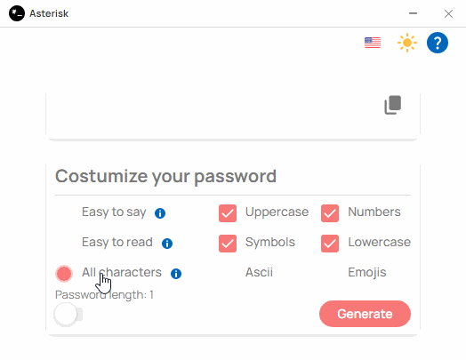

## About

  Beautiful desktop application for your pocket to generate passwords.

## Compile

The application was made with TypeScript and Vue, so we recommend you follow the guide below:

### Transpiling TS files (TypeScript required)

`npm run tsc` or `yarn run tsc`

### Vite

`npm run vite` or `yarn run vite`

## Production

- Change the mode to "production" in the `vite.config.js` file.

## Features

- Simple and straightforward.
- Compatible with Windows (7, 8, 10) and Linux.
- Multi-language: en-US and es-419.

## Screenshots

  

## License

MIT